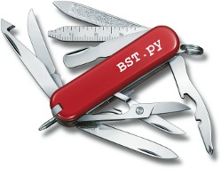

# ToolBOS Core

This package provides `BST.py` and helper scripts, to make native and
cross-compilations easier when using a Software Installation Tree (SIT).

## Setup

### a) From Git repository

```bash
$ uv sync

$ source .venv/bin/activate

$ source useFromHere.sh

$ BST.py [options]
```

### b) From SIT

```bash
$ source /hri/sit/latest/DevelopmentTools/ToolBOSCore/5.2/BashSrc

$ BST.py [options]
```

## Usage

```bash
$ BST.py [options]
```

### Native compilation

```bash
$ cd ~/local/ToolBOSLib

$ BST.py
```

### Cross-compilation from Linux to Windows

```bash
$ cd ~/local/ToolBOSLib

$ BST.py -p windows-amd64-vs2017
```

Note: We execute the Microsoft Visual Studio compiler and linker under Linux,
using the [Wine](https://www.winehq.org) framework. Thus, the resulting
binaries do not link against any emulation layer or helper libraries.    

## Documentation

* [Advanced options (ToolBOS.conf)](doc/ToolBOSConf.md)
* [FAQ Windows/VisualStudio troubleshooting](doc/WindowsFAQ.md)


## License

* [BSD 3-Clause License](LICENSE)
