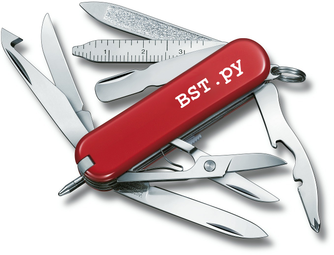

# ToolBOS Core

This package provides `BST.py`, which makes native and cross-compilations
easier when using a Software Installation Tree (SIT).

# Usage

```bash
$ source /path/to/ToolBOSCore/BashSrc

$ BST.py --help
```

### Usage

* [Cross-compilation](doc/CrossCompilation.md)
* [ToolBOS.conf (settings)](doc/ToolBOSConf.md)


### License

* [BSD 3-Clause License](LICENSE)
