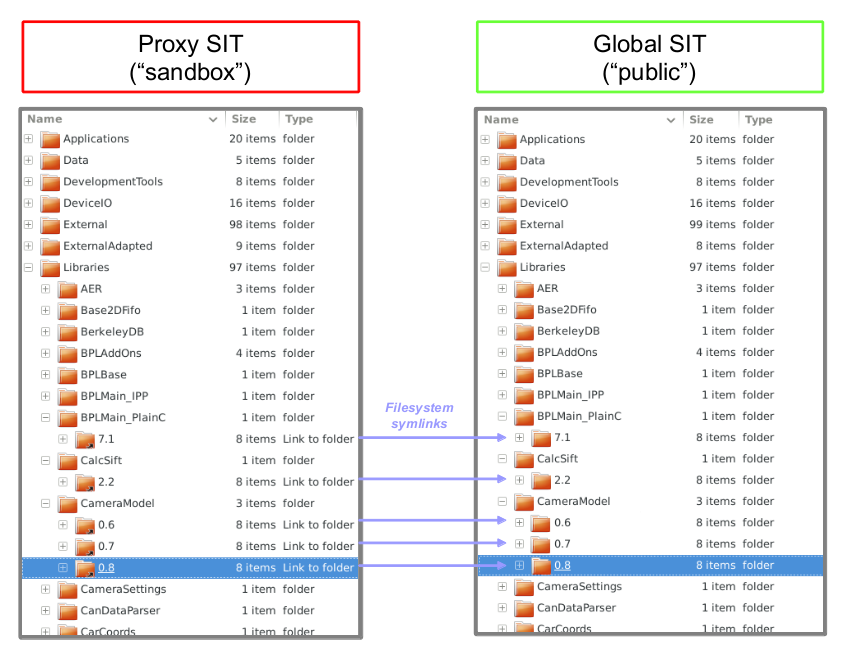
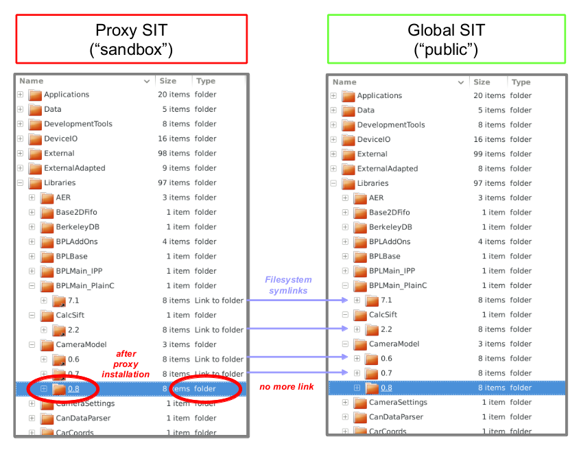

## Proxy Directory               

A **proxy directory** is a sandbox for testing software.

### Key concepts

* directory tree with same structure like the main [SIT](SIT.md)
* used to test software (prior to release)
* every user has such proxy directory which shadows/masks the content of the global SIT
* referenced via environment variable SIT
* at the beginning the proxy directory contains symlinks into global SIT
* when installing software into the proxy directory such symlinks will be replaced by actual directories with real content
* users can test changes of their software without affecting anybody else

### Creation

Under Linux you typically don't need to create a new proxy directory as it was already done by ToolBOS-Setup.py.  
This creates a proxy directory located in ${HOME}/.HRI/sit/latest.   

    $ CreateProxyDir.py

Initially all "versions" inside the proxy directory are symlinks:

### Installing into proxy directory

To install a software package into a proxy directory, use: 

    $ BST.py -x
    
Then you will find a corresponding directory with the package content inside your proxy directory:

### Updating

You need to update the proxy directory once in a while. This will add symlinks to packages newly installed into 
the global SIT:

    $ UpdateProxyDir.py
    
### FAQ

**How can I find out which packages are currently installed in my proxy directory?**

FindProxyInstallations.py scans the proxy directory for installations. It lists one software package per line. 
If you do not have any proxy installations then this script will output nothing.

    $ FindProxyInstallations.py
    
**How can I remove a package from the proxy directory?**

There are 3 possibilities:

* Just delete the directory. If a global installation of the package exists you may run UpdateProxyDir.py
  to create again the symlink to the global installation.
* Perform a global installation of the package. This will automatically delete any existing proxy installation of the 
  package and create a symlink in the proxy pointing to the new global installation.
* Delete ALL proxy installations using "UpdateProxyDir.py -r" (see question below).

**I have a bunch of packages installed in my proxy. Can I reset the proxy directory in one shot back to a clean state?**

Sure. UpdateProxyDir.py provides an "-r" option for such purposes: 

    $ UpdateProxyDir.py -r
    
**Do proxy directories work on Windows?**

This is theoretically possible but not implemented, yet. In case please raise a feature request but be aware of:  
From Wikipedia: "The default security settings in Windows Vista/Windows 7 disallow non-elevated administrators and 
all non-administrators from creating symbolic links."  
Hence regular users could not run UpdateProxyDir.py unless corresponding privileges are granted by the administrator.

**See also**

[NTFS symbolic link](http://en.wikipedia.org/wiki/NTFS_symbolic_link)

