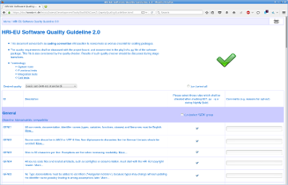
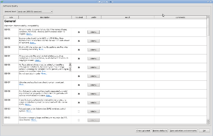
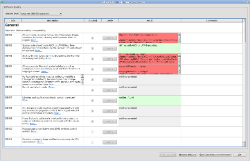

##  Quality Guideline

* List of coding conventions, with explaination and weblinks.
* Guideline for project board to define quality requirements.
* Check functions for measurement and validation.

###  Defining quality requirements

 <table border="0" width="100%">
 <tr>
      <th width="50%" style="background: #3d578c; color: white;">online</th>
      <th width="50%" style="background: #3d578c; color: white;">desktop utility</th>
 </tr>
 <tr>
      <td>
          
      <ol>
          <li>Open <a href="https://doc.honda-ri.de/hri/sit/latest/Intranet/TopicPortal/3.0/web/QualityGuideline.html">Quality Guideline</a></li>
          <li>Choose a desired quality level from the dropdown menu,
              and in case opt-in/out further rules using the
              checkboxes.</li>
          <li>At the bottom of the page you can find the necessary
              settings for your <tt>pkgInfo.py</tt> file, or directly
              download it. Do not forget to commit them to your version
              control system.
          </li>
      </ol>
      </td>
      <td style="border-style: solid; border-width: 1px; border-color: #ced6e9;">
          
      <ol>
          <li>Launch application:
              
$ BST.py -qz
</li>
          <li>Choose a desired
              quality level from the dropdown menu, and in case opt-in/out
              further rules using the checkboxes.</li>
          <li>Finally press "Save settings".</li>
      </ol>
      </td>
 </tr>
 </table>
 
 
 ###  Validation
 
 
  <table border="0" width="100%">
  <tr>
       <th width="50%" style="background: #3d578c; color: white;">command-line</th>
       <th width="50%" style="background: #3d578c; color: white;">desktop utility</th>
  </tr>
  <tr>
       <td style="border-style: solid; border-width: 1px; border-color: #ced6e9;
                  vertical-align: top;">
       Run the following command within your package:
       
$ BST.py -q

       It is also possible to specify selected rules and/or
       files/directories, e.g. the following command will only validate
       rules C01,C02,C03 on the "src" subdirectory:
       
$ cd MyPackage/1.0 
                                            $ BST.py -q src C01 C02 C03

       </td>
       <td style="border-style: solid; border-width: 1px; border-color: #ced6e9;">
       <ol>
           <li>Press the individual "Check" buttons to perform the
               verification:
               
           </li>
           <li>Alternatively you could press "Check selected" to run all
               checkers.</li>
       </ol>
       </td>
  </tr>
  </table>
 
 
**see also:**
* [Zen Build Mode](../Tools/BuildSystemTools/ZBM.md)
* http://en.wikipedia.org/wiki/Software_quality
