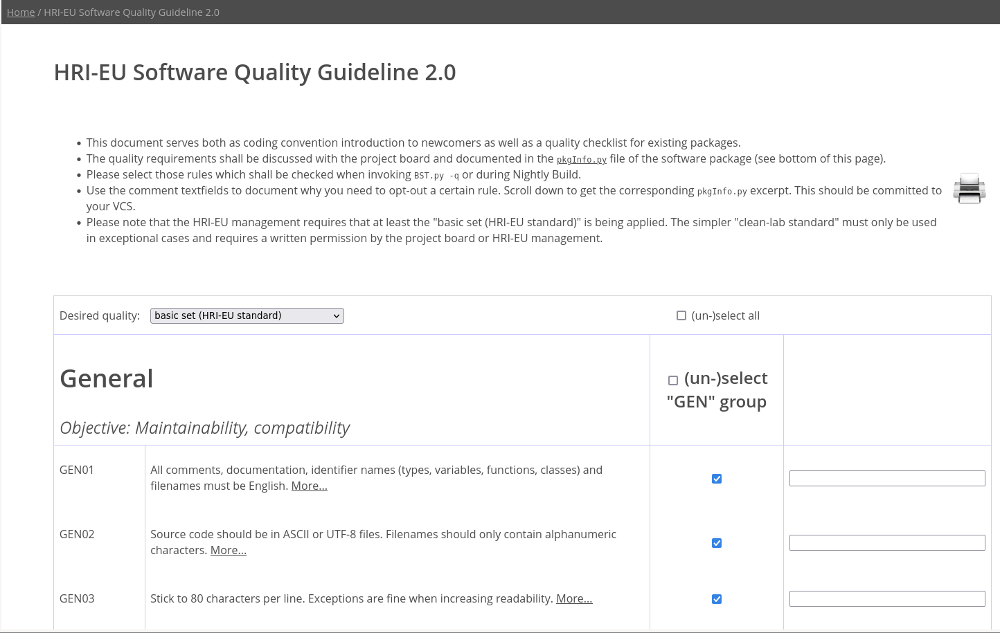
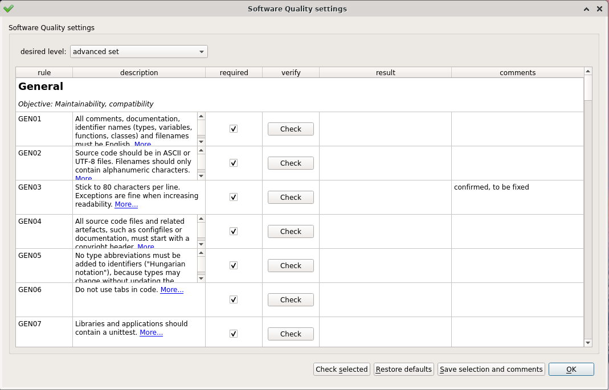
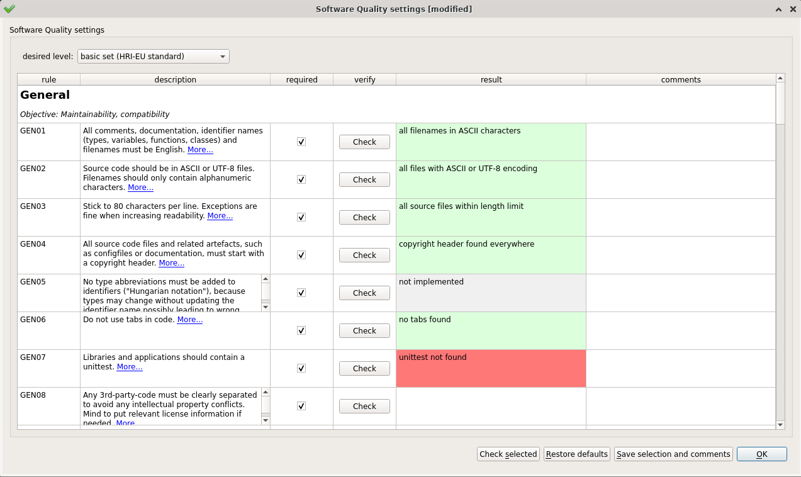

##  Quality Guideline

* List of coding conventions, with explanation and weblinks
* Guideline for project board to define quality requirements
* Automated check functions for measurement and validation
* Checks are divided into several categories like C/C++ specific, Python
  specific, General rules with   
  focus on maintainability, compatibility, Documentation rules for better
  user experience etc.
* Available as commandline and desktop utility


### Prerequisite:

Source ToolBOSCore in your path:
   
       $ source /hri/sit/latest/DevelopmentTools/ToolBOSCore/4.0/BashSrc


###  Defining quality requirements:

In order to run our quality checker you need to first setup pkgInfo.py which
defines your quality requirements.This can be configured in 3 ways as shown
below:

* [Providing pkgInfo.py manually](#pkgInfo_manually)
* [Generating pkgInfo.py using online utility](#pkgInfo_via_online_utility)
* [Generating pkgInfo.py using desktop utility](#pkgInfo_via_desktop_utility)


### Manually by providing pkgInfo.py: <a name="pkgInfo_manually"></a>

**Configuring your pkgInfo.py:**  
1. Configure pkgInfo.py as per your project requirement and
   add it to your package.
2. Do not forget to commit them to your version control system.  

Below, you find an example pkgInfo.py file with various quality
checker specific configurations.

```
# -*- coding: utf-8 -*-
#
#  Custom package settings
#
#  Copyright (C)
#  Honda Research Institute Europe GmbH
#  Carl-Legien-Str. 30
#  63073 Offenbach/Main
#  Germany
#
#  UNPUBLISHED PROPRIETARY MATERIAL.
#  ALL RIGHTS RESERVED.
#
#


name             = 'ToolBOSCore'

version          = '4.0'

category         = 'DevelopmentTools'

sqlevel          = 'advanced'

sqOptOutRules    = [ 'C10' ]

# opt-out testcase data that would provoke a failure of SQ check onto this package
sqOptOutDirs     = [ 'test/SoftwareQuality/CheckRoutine/ReferenceData' ]

sqComments       = { 'GEN03': 'confirmed, to be fixed',
                     'C10'  : 'do not invoke Klocwork on example files' }

# EOF

```

You can find example [pkgInfo.py](../../../examples/pkgInfo.py) file here.
For more info on pkgInfo.py goto: 
[more on pkgInfo.py](../Tools/BuildSystemTools/PkgInfo.md)


### Generating pkgInfo.py using online utility: <a name="pkgInfo_via_online_utility"></a>

1. Open [Quality Guideline](https://doc.honda-ri.de/hri/sit/latest/Intranet/TopicPortal/3.0/web/QualityGuideline.html).
2. Choose a desired quality level from the dropdown menu, and in case
opt-in/out further rules using the checkboxes.
3. At the bottom of the page you can find the necessary settings for your
pkgInfo.py file.  
4. Review the list of rules, and in case your project has different
requirements then select the checkboxes accordingly.  
5. If your software package already has a pkgInfo.py file then add the new
configurations to this file. Otherwise, download this file and add it to your
package.
6. Do not forget to commit them to your version control system.




### Generating pkgInfo.py using desktop utility: <a name="pkgInfo_via_desktop_utility"></a>

1. Launch application:
   
       $ BST.py -qz
   
2. Choose a desired quality level from the dropdown menu.
3. In case opt-in/out further rules enable/disable using the checkboxes.
3. Press "Save settings".




### Usage

You can run the checker in 2 ways as shown below:

* [Run quality checker via command-line](#command_line)
* [Run quality checker via desktop utility](#desktop_utility)


### Run quality checker via command-line: <a name="command_line"></a>

Run the following command within your package:   

    $ BST.py -q

It is also possible to specify selected rules and/or files/directories,
e.g. the following command will only validate rules C01,C02,C03 on the "src"
subdirectory:   

    $ cd MyPackage/1.0  
    $ BST.py -q src C01 C02 C03

Users can also select group of rules to run using following commands:

    $ cd MyPackage/1.0
    $ BST.py -q 'group=GEN,PY'  # runs general and python specific rules
    $ BST.py -q 'group=C'       # runs C and Cpp specific rules

The supported groups are: 'GEN', 'C', 'PY', 'MAT', 'DOC', 'SAFE', 'SPEC', 'BASH'

### Run quality checker via desktop utility: <a name="desktop_utility"></a>



1. Press the individual "Check" buttons to perform the verification
2. Alternatively you could press "Check selected" to run all checkers


### Additional documentation:

* [**Quality Guidelines Overview**](https://doc.honda-ri.de/hri/sit/latest/Intranet/TopicPortal/3.0/web/QualityGuideline.html)
* [**GEN04: License specific configurations**](../HowTo/LicenseChecks.md)