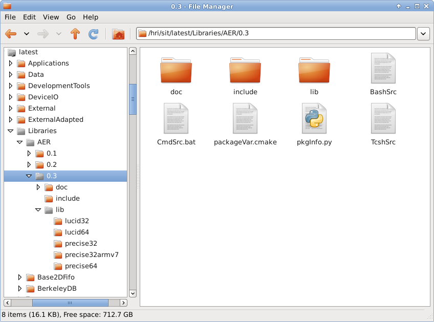

## Software Installation Tree (SIT)

### Overview

The idea of a centrally shared "Software Installation Tree" arose from the problems of different software versions 
installed on several machines. Therefore we have established an NFS share containing all software. This NFS share is 
mounted on all computers so that everybody uses the same software state.

> #### Attention
>
> A basic principle is to NEVER hardcode the path anywhere in the software but always refer to the environment variable
> ${SIT} which is supposed to point to the root path which contains all the software. At HRI-EU the default SIT root 
> path is /hri/sit/latest but you should never rely on this path as it changes from time to time.

### Directory structure

  
For human readability the directory tree is organized in categories, e.g.:

* Applications (big standalone packages)
* DeviceIO (drivers etc.)
* Libraries (shared functionalities)
* Modules (components to be used in larger frameworks)
* External (3rd party software)

#### See also
[Proxy Directory](ProxyDirectory.md)  
[Installation Conventions](InstallationConventions.md)

### Advanced: Bootstrapping a new SIT

A brand-new SIT can be created using BootstrapSIT.py. This might be useful when distributing software to partners. 
See also:
 
    $ BootstrapSIT.py --help

