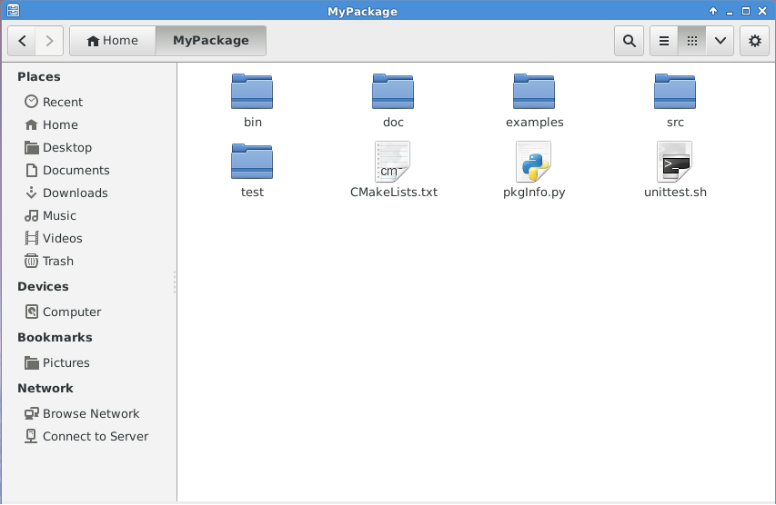

## Source tree conventions

We assume that software packages are organized in the following directory structure, closely following the
"Build system And Software Implementation Standard (BASIS)" and "Semantic versioning" approach.

**See also**  
[Semantic Versioning](https://semver.org/)

**Only the pkgInfo.py file is mandatory.**  
All others are optional and you may freely add more. But for the once mentioned 
please try to stick to the existing names and semantics for consistency reasons.

| Name           | Things you should know about                                                              | Content                                                              |
| :------------- |:-------------                                                                             | :-----                                                               |
| MyPackage      | Name of the package                                                                       | Contains one subdirectory per package version or branch              | 
| bin            | Each source file will be compiled into one corresponding executable.                      | Source code of the main programs / executables (e.g.: HelloWorld.c)  |
| doc            | You may put additional PDF files, diagrams etc. here and refer to it from within doxygen  | doxygen documentation will be created inside the subdirectory "html" |
| examples       | similar to "bin"                                                                          | simple exemplary programs to demonstrate the usage of your software to the end user | 
| external       | 3rd party content that can/should not be separately installed into SIT (${SIT}/External)  | Non-HRI parts                                                        |
| install        | required directory used by Build System Tools                                             | auto-generated files used by ToolBOS and intermediate files during package installation phase |
| lib            | You should not put any files there.This is directory is for exclusive use by the Build System Tools. You should remove such directory if your package is not about static and/or shared libraries.| the generated static and shared libraries |
| src            | put here your C/C++/Java/Matlab/... sources                                               | the main source code of the package |
| include        | put here your Python sources                                                              | the main source code of the package |
| test           | You may use any framework for implementing your unit tests. However it is strongly encouraged to provide a file "unittest.sh" within your directory which serves as launcher script for the Nightly Build system, e.g. MyPackage/unittest.sh. | code and reference files for unittest |
| pkgInfo.py     | General package related information. (Should always be present in the package)            | Contains the version of the package (Major.Minor), name of the package and the category this package belongs to. **See also** [pkgInfo.py](../Tools/BuildSystemTools/PkgInfo.md)|  

> **Note**  
>        Directories which contain the generated binaries (e.g. "bin" or "lib") will have one subdirectory per platforms 
>        the package was compiled for. You can later install the package for multiple platforms in one shot. 

