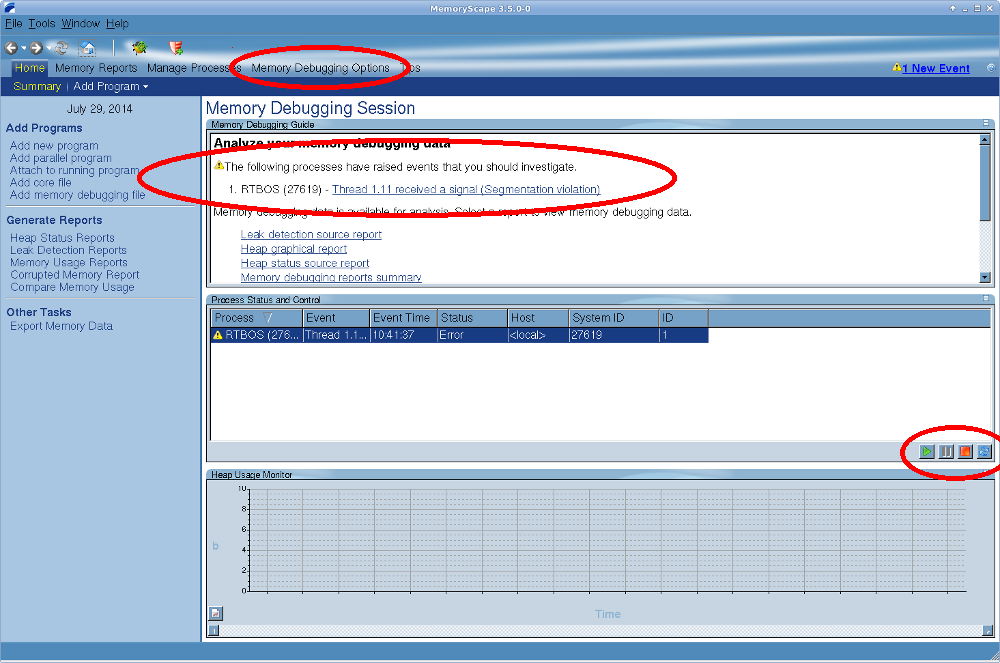

## Segfaults + Memory leaks

The operating system "tracks" the memory regions assigned to processes. If the O.S. detects an access to other memory
regions, it will terminate the process with SEGV (segmentation violation aka "segfault"). This is typically caused by an
invalid or NULL pointer. The root of the problem might be access on freed memory or wrong pointer arithmetics.

In case of memory leaks the developer forgot to free unused memory. Even though this often does not harm, the operating 
system can not grant this memory anymore until the application terminated. But if there is a problem in recycling memory 
areas or memory is wrongly recycled, more and more memory is allocated resulting in increasing memory consumption over time. 
The machine will entirely run out of (available) memory because the faulty application consumes it all. Once all the 
machine's memory is allocated, the application may crash.

See also   
* [Segmentation fault](http://en.wikipedia.org/wiki/Segmentation_fault) 
* [Memory leak](http://en.wikipedia.org/wiki/Memory_leak)

###  System monitors

* top
* htop
* gkrellm

###  Trace messages

Put the macro ANY_WHERE in your C/C++ code. At execution time this will log some trace message like: 

    [5257.337489 3452:0 AnyWhere.c:24 Info] in function: main()
    
This might help to identify which functions are executed.

###  Valgrind

Check application for memory leaks: 

    $ valgrind --tool=memcheck --leak-check=full --show-reachable=yes ./myProgram
    
> **Note**  
>   For finding memory leaks in large DTBOS graphs, divide the crashing graph into subgraphs and place parts on separate 
>   hosts resp. processes (green "machine" boxes). Then see which machine crashes, and iterate this until the crashing 
>   component was encircled. Then you can debug this component in detail.

###  Dr. Memory

Similar to Valgrind is Dr. Memory which can also be hooked into Visual Studio.

    $ drmemory -- <executable> [arguments]
    
**See also**  
    http://www.drmemory.org  
    http://www.drmemory.org/docs/index.html
    

###  Electric Fence

The "libefence" tracks memory access and immediately fires a segfault if unauthorized access is detected. With the help 
of that, you can run the application under control of a debugger and quickly find the location where the segfault has 
occurred.
Simply link against libefence.so by adding **efence** to the **BST_LIBRARIES_SHARED** in your **CMakeLists.txt** file:

    list(APPEND BST_LIBRARIES_SHARED efence)
    
> **Attention**  
> Only heap memory allocated via malloc() will be checked. Stack variables are not considered by Electric Fence.
> Electric Fence supports only 512 malloc() calls. Use libDUMA for larger applications

The malloc() function will be replaced by the Electric Fence library. You can see it at the beginning of the console output:

    Electric Fence 2.1 Copyright (C) 1987-1998 Bruce Perens.
    Segmentation fault
    
If a memory violation occurs a segfault will be triggered. Analyze the location of the segfault with a debugger.

###  libDUMA

The DUMA (Detect Unintended Memory Access) library is a fork of Electric Fence (see above) with more features:

* "overloads" more C functions, e.g. memalign(), strdup(), free() etc.
* C++ new / delete support
* utilizes the MMU (memory management unit) of the CPU
* leak detection: detect memory blocks which were not deallocated until program exit

**See also**  
    http://duma.sourceforge.net
    
To use it:

    $ source ${SIT}/External/duma/2.5/BashSrc
    $ export LD_PRELOAD=libduma.so.0.0.0
    
The malloc() etc. functions will be replaced by the DUMA library. You can see it at the beginning of the console output:

    DUMA 2.5.15 (shared library, NO_LEAKDETECTION)
    Copyright (C) 2006 Michael Eddington <meddington@gmail.com>
    Copyright (C) 2002-2008 Hayati Ayguen <h_ayguen@web.de>, Procitec GmbH
    Copyright (C) 1987-1999 Bruce Perens <bruce@perens.com>
    
If a memory violation occurs a segfault will be triggered. Analyze the location of the segfault with a debugger.

**See also**  
    [Source-code debugging](SourceCodeDebugging.md)
    

###  MemoryScape
     
...is a commercial product by Rogue Wave Software, Inc. . HRI-EU got a license bundled together with the TotalView debugger.
     
**See also**  
       http://www.roguewave.com/products/memoryscape.aspx 
       http://www.roguewave.com/support/product-documentation/totalview.aspx
       
             
     $ source ${SIT}/External/totalview/8.15/BashSrc
     
     $ memscape <executable> [-a <arguments>]
     
Example:

    $ memscape $TOOLBOSCORE_ROOT/bin/$MAKEFILE_PLATFORM/RTBOS -a -i local -f Foo.cml
    

###  MTrace

mtrace is the memory debugger included in the GNU C Library.

**See also**  
    http://en.wikipedia.org/wiki/Mtrace

**1. Enable "mtrace" in your package**

Include the headerfile:

    #include <mcheck.h>

Encircle the portion of code to be checked with the following function calls:

    mtrace();
    ...
    muntrace();     // optional
    
> Note
> For small programs it is typically fine to just put mtrace() at the beginning of the main() function.
  
Recompile your package. No additional libraries are needed.

**2. Execute the program**

mtrace writes memory usage information into a file. Specify its path using the MALLOC_TRACE env.variable:

    $ export MALLOC_TRACE=mtrace.log

Then run your program, e.g.:

    $ RunFromSourceTree.sh ./examples/${MAKEFILE_PLATFORM}/ExampleProgram [args]

**3. Show memory information**

Use the mtrace utility to parse the temporary file. It will show the locations of memory violations. It takes the path to the executable and temporary file as arguments.
  
    $ mtrace <executable> <logfile>
    
**Example:**

    $ mtrace ./examples/${MAKEFILE_PLATFORM}/ExampleProgram mtrace.log
    
    Memory not freed:
    -----------------
               Address     Size     Caller
    0x0000000001be9460      0x4  at ./examples/AnyFree.c:29

As you can see, AnyFree.c:29 contains the location of the memory leak.

> **Note**  
> There is also a KDE-based GUI "kmtrace" for visualizing mtrace outputs.

