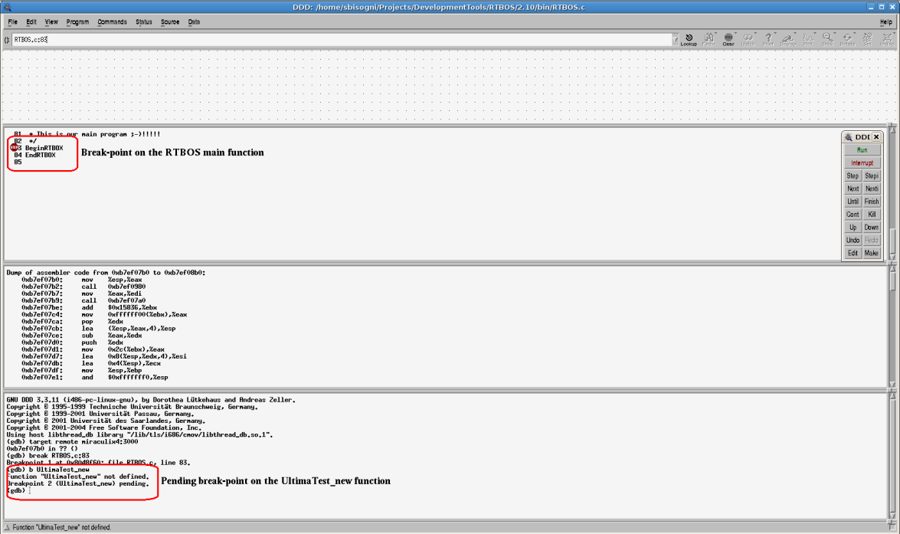
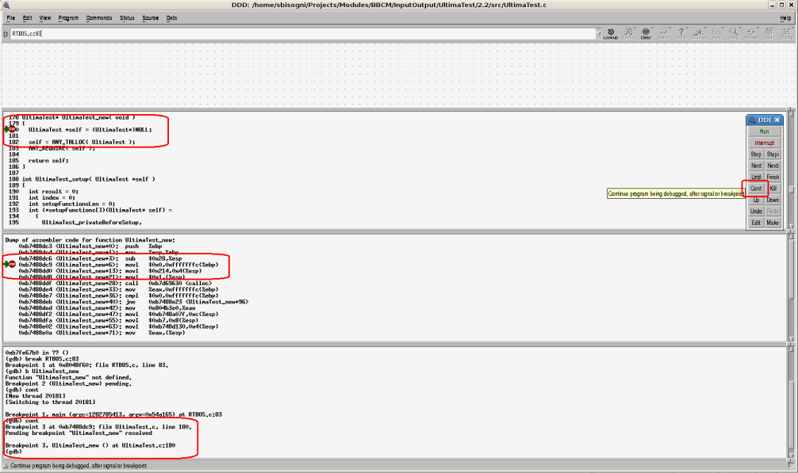
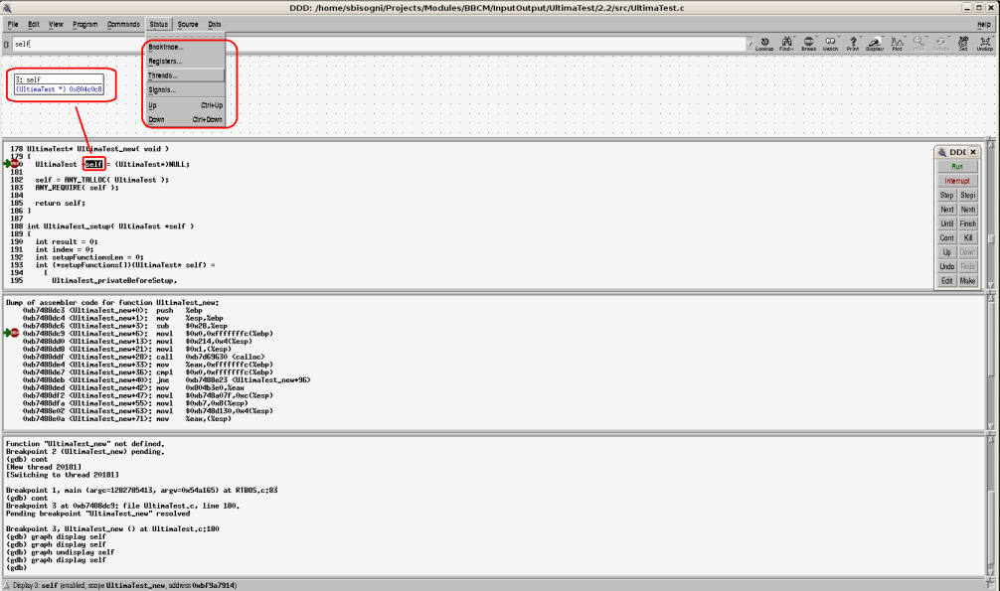

### Debugging with DDD

See ToolBOS_HowTo_Debugging_RTBOS how to start RTBOS under control of gdbserver .
Then Connect to the gdbserver by using DDD in remote mode:

    $ ddd ${TOOLBOSCORE_ROOT}/bin/${MAKEFILE_PLATFORM}/RTBOS

**GUI overview:** 

On the "GDB Console" call the command:

    (gdb) target remote localhost:3000

You can set breakpoints by using the command **break** (b) command with the GDB Console or, when the source code is 
available within the Source Window, double-clicking at the left-hand side of the instruction you are interested in.

The two cases are shown in the image below where the breakpoint on the RTBOS main function is set directly from the 
Source Window while the breakpoint on the UltimaTest_new function is set from the GDB Console: 

As you can see the breakpoint on the UltimaTest_new is set as pending. This is because, at this moment, RTBOS has not
loaded yet any shared object, so gdb will set it automatically pending until the associated symbol will be loaded.

Click on the **cont** button into the Command Tool to continue the program execution. The next screenshot shows the arrival 
to the UltimaTest_new breakpoint. The content of the Source Window, Code Machine Window and GDB Console is updated 
accordingly. 

You can now query the application through the Status menu in the DDD main bar or by using the Command Tool to navigate 
into the code. You can visualize the status of variable double-clicking on it from the Source Window: 

