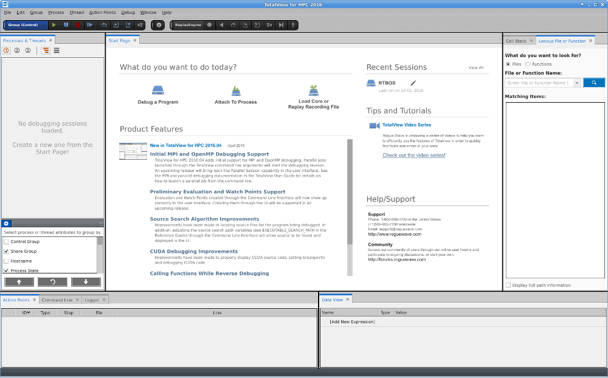

###  Debugging with TotalView

**TotalView for HPC** is a commercial product by Rogue Wave Software, Inc. . 
HRI-EU got a license bundled together with MemoryScape.

**Usage:**

    $ runTotalView.sh <executable> [-a <arguments>]

**Example:**

    $ runTotalView.sh $TOOLBOSCORE_ROOT/bin/$MAKEFILE_PLATFORM/RTBOS -a -i local -f Foo.cml
    

**See also**  
    http://www.roguewave.com/products-services/totalview 
    http://www.roguewave.com/help-support/documentation/totalview 