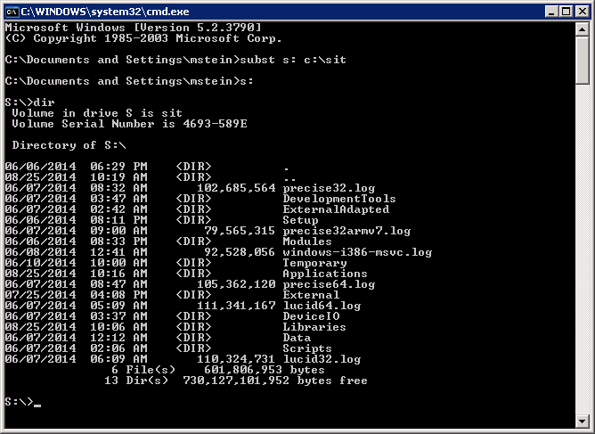
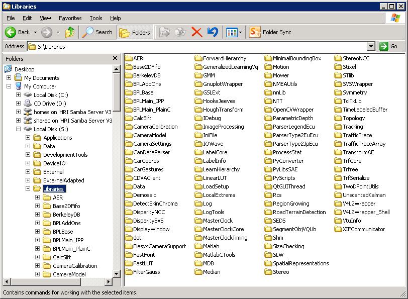

## Installing ToolBOS on disk

>Note
>
>    For sites running multiple ToolBOS machines it is common to put the data on a network share and mount the content
>    appropriately on clients, rather than copying to each local disk individually.

### Linux

* Create the following directory:
    
      $ mkdir -p /hri/sit
      
* Copy the Software Installation Tree (SIT) that you have received into the /hri/sit directory.
  Example:

      $ cp -R /media/dvd/* /hri/sit
      

* Now the following directories should exist:

    * /hri/sit/builds
    * /hri/sit/LTS
    * /hri/sit/latest (symlink to builds/latest)

### Windows

* Copy the Software Installation Tree (SIT) that you have received to some local directory
  (e.g. c:\SIT)
* Map the drive letter S: to this directory. Open a terminal using "Start → Run → cmd.exe" and enter the following 
  command (replace c:\SIT accordingly).
  
      subst s: c:\SIT
      

* Now you should be able to browse the new "drive" s: within Windows explorer:

