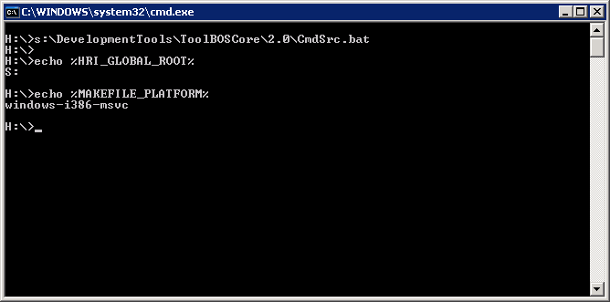

##  Shell configuration

### Linux

ToolBOS needs some environment variables and files present in your home directory.  
Please execute the following commands and follow their instructions:

    $ source /hri/sit/latest/DevelopmentTools/ToolBOSCore/3.2/BashSrc   
    
    $ /hri/sit/latest/DevelopmentTools/ToolBOSCore/3.2/bin/ToolBOS-Setup.py
    
As mentioned by the script, please add a line like this to your ~/.bashrc, and then logout and login again.

    source /hri/sit/latest/DevelopmentTools/ToolBOSCore/3.2/BashSrc
    
    
### Windows

ToolBOS needs some environment variables which can be brought up with this script:

    S:\DevelopmentTools\ToolBOSCore\2.0\CmdSrc.bat
    
 