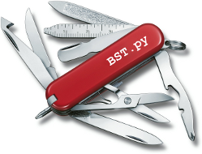

##  Cleaning

To remove binaries and auto-generated files from your package:

    $ BST.py -d

or 

    $ BST.py --distclean
    
 
###  Customization
     
To customize (opt-in / opt-out) file patterns that shall be deleted or not upon 'BST.py -d', please create a file named pkgInfo.py within your package's top-level directory (e.g. MyPackage/1.0/pkgInfo.py).

####  Simple example

    # also delete the following files:
    delete      = [ 'deleteMe.*\.txt' ]
    
    # do not delete the following files:
    doNotDelete = [ 'install/??shSrc' ]
    

####  Complicated example
      
The pkgInfo.py file may contain arbitrary Python code, e.g.:

    from ToolBOSCore.Platforms.Platforms import getPlatformNames
    platformList = getPlatformNames()
    # also delete the following files:
    delete = [ 'doc/man',
               'etc/mirror/*.log',
               'lib/*.jar',
               '*py.class' ]
    for item in ( 'foo', 'bar', 'baz' ):
         for platform in platformList:
             delete.append( '%s/%s' % ( item, platform ) )
             
**See also**   
      [pkgInfo.py](PkgInfo.md) 