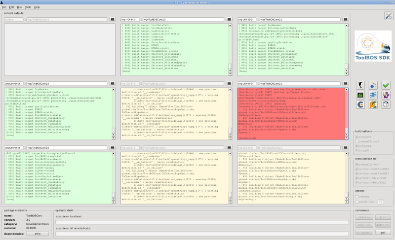

##  Cross-compiling

    

> Note   
>   In case of Linux-to-Windows cross-compilation it means executing the compiler and linker from Microsoft Visual 
>   Studio under Linux, using the Wine framework. Thus these are the same executables in both environments. 
>   The generated binaries do not link against any emulation layer or helper libraries.    

###  GUI usage

Go to the top-level directory of your package and start the [Zen Build Mode](ZBM.md)    
Within the GUI select the desired platform(s) to build for and press the 

    $ cd MyPackage/1.0
    $ BST.py -z
    

###  Command-line usage

To compile for a different platform invoke BST.py with the -p parameter and the target platform name.
The names of supported platforms can be listed using "-p help" or found here:[Supported Platforms](../../Setup/SupportedPlatforms.md)

**Example:**

    $ cd Example/1.6
    
    $ BST.py -p windows-amd64-vs2012
    [BST.py:532 INFO] targetPlatform=windows-amd64-vs2012
    -- The C compiler identification is MSVC 17.0.50727.1
    -- The CXX compiler identification is MSVC 17.0.50727.1
    -- Check for working C compiler: /home/mstein/.HRI/sit/latest/DevelopmentTools/ToolBOSPluginWindows/1.2/bin/cl
    -- Check for working C compiler: /home/mstein/.HRI/sit/latest/DevelopmentTools/ToolBOSPluginWindows/1.2/bin/cl -- works
    -- Detecting C compiler ABI info
    -- Detecting C compiler ABI info - done
    -- Check for working CXX compiler: /home/mstein/.HRI/sit/latest/DevelopmentTools/ToolBOSPluginWindows/1.2/bin/cl
    -- Check for working CXX compiler: /home/mstein/.HRI/sit/latest/DevelopmentTools/ToolBOSPluginWindows/1.2/bin/cl -- works
    -- Detecting CXX compiler ABI info
    -- Detecting CXX compiler ABI info - done
    
    Top-level directory:    /home/mstein/Example/1.6
    Package name:           Example
    Package full version:   1.6
    Major version:          1
    Minor version:          6
    CMake generator:        Unix Makefiles
    including package:      sit://DevelopmentTools/ToolBOSCore/3.2
    including package:      sit://Libraries/MasterClockCore/1.2
    -- Configuring done
    -- Generating done
    -- Build files have been written to: /home/mstein/Example/1.6/build/windows-amd64-vs2012
    Scanning dependencies of target Example-global
    
    [...]
    
    [100%] Building C object CMakeFiles/ExampleClient.dir/bin/ExampleClient.c.obj
    ExampleClient.c
    Linking C executable ../../bin/windows-amd64-vs2012/ExampleClient.exe
    [100%] Built target ExampleClient