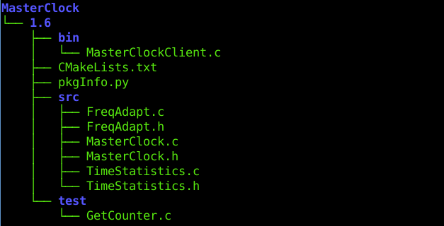
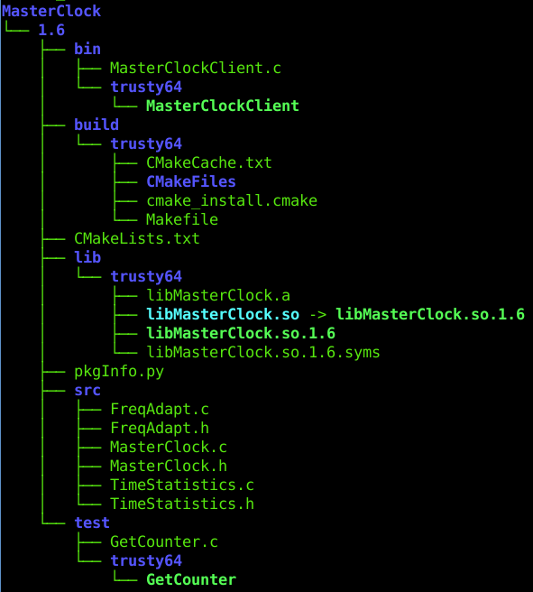
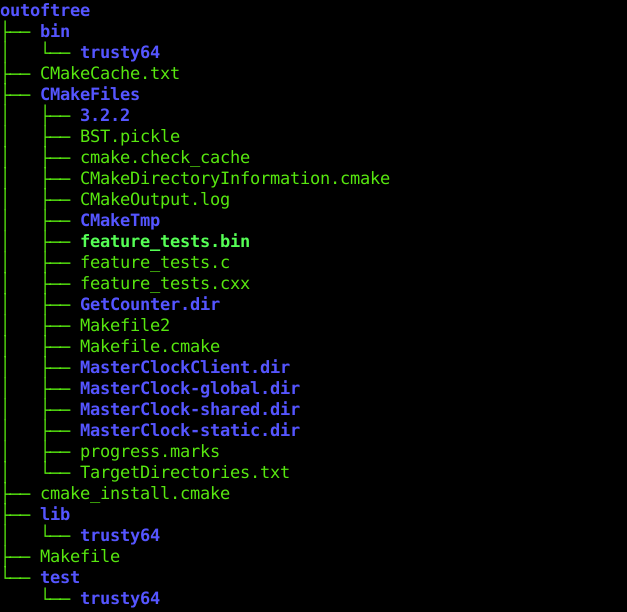

##  In-tree- vs. out-of-tree builds

###  Source directory

*Clean SVN working copy at start-up*

###  In-tree builds

For historical reasons most ToolBOS users perform **"in-tree builds"**, f.i. the compiled binaries stay together with 
the source code. However this somehow clutters the source tree.

    $ cd ~/MasterClock/1.6
    
    $ BST.py
    [...]
    

*After compilation the build artefacts can be found inside the source tree*

###  Out-of-tree builds
     
 This way the source code (e.g. SVN working copy) stays separate from the build artefacts. 
 This implies working with two different file locations, referred to as "source tree" and "binary tree".
 
     $ cd /tmp/mstein/outoftree
     
     $ BST.py ~/MasterClock/1.6
     [BST.py:482 INFO] source tree: /home/mstein/MasterClock/1.6
     [BST.py:483 INFO] binary tree: /tmp/mstein/outoftree
     [...]
     
> **Note**  
> You need to pass the source-tree location only once. Subsequent calls of BST.py will remember the corresponding 
> source-tree location.

*The source tree stays untouched*

*The build artefacts are separated from the source tree*
