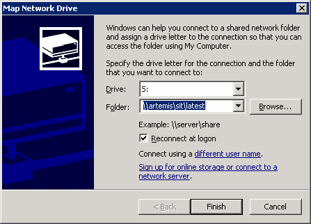
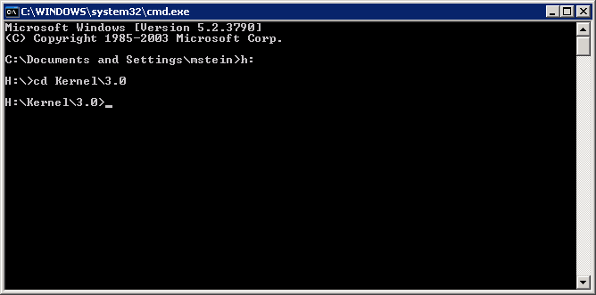
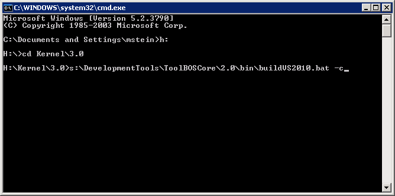
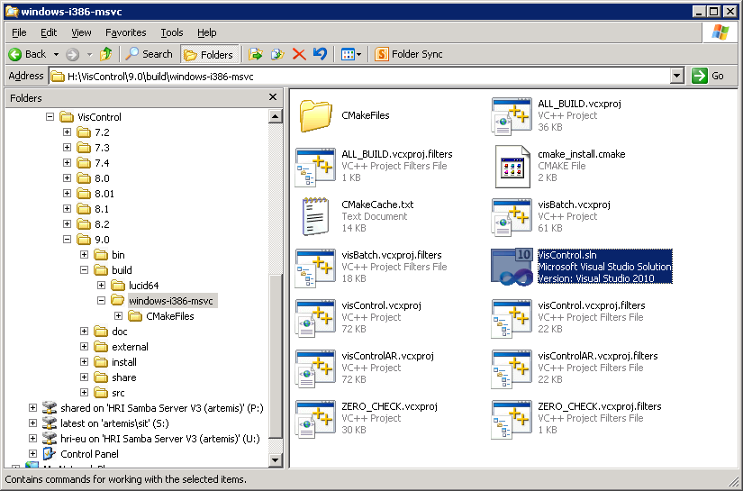
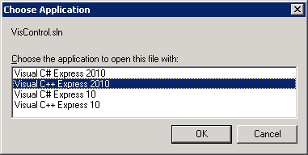
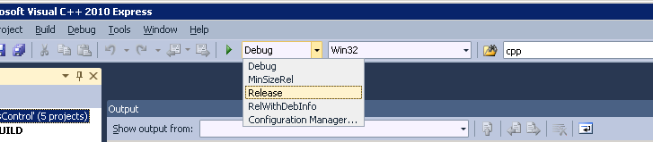
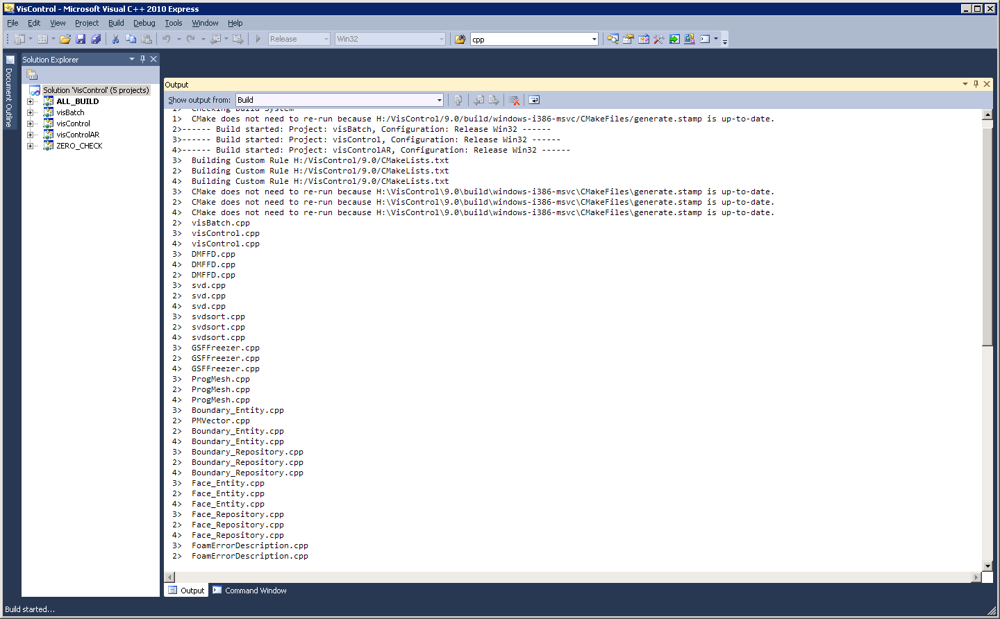

##  VS2010 on WinXP (IDE)         {#VS2010_WinXP_IDE}

###  1. Have SIT available on Windows

For a quick start we expect to have the SIT network share mapped to drive letter S:\ .

You can map network drives under "MyComputer" → "Tools" → "Map network drive".

###  2. Step into package

Open a console (cmd.exe) and navigate to your package.

###  3. Launch package configuration
     
Run buildVS2010.bat with "-c" parameter. This script auto-detects the CPU architecture (32 / 64 bit), prepares the environment and then invokes BST.py –setup.
     
This will result in a Visual Studio project file ("solution").

###  4. Open the Visual Studio solution-file (*.sln)

### 5. Switch to "release" mode and press build button

