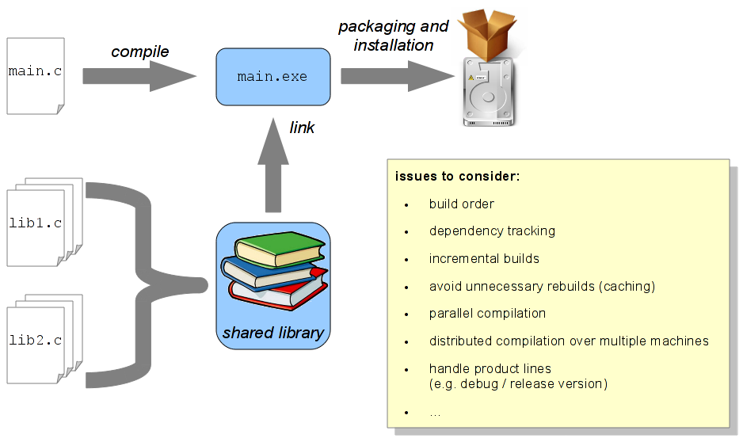

## About

* The Build System Tools (BST.py) are using underlying OS-specific tools such as compilers and linkers for compiling 
  and installing software packages.
* They can directly be used by the developers, but also integrated into build automation systems (f.i. CIA).
* The Build System Tools attempt to handle different types of packages equally (regardless their programming language 
  or if they are developed in-house or externally).

