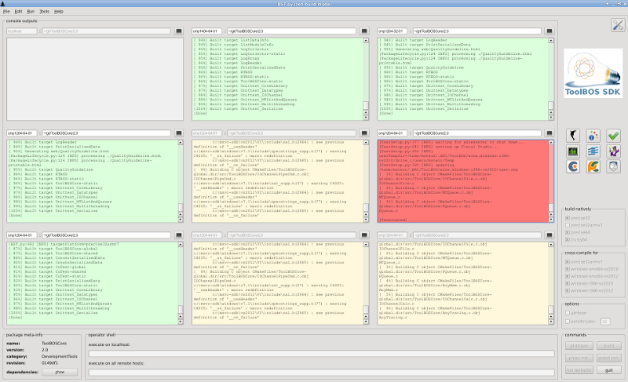

##  Quickstart on Linux

###  GUI usage

Go to the top-level directory of your package and start the [Zen Build Mode](ZBM.md). Within the GUI select the desired 
platform(s) to build for and press the Build button.

    $ cd MyPackage/1.0

    $ BST.py -z
    
    

###  Command-line usage

Go to the top-level directory of your package and run BST.py : 

    $ cd MyPackage/1.0

    $ BST.py
    [...compiler output...]
    
        
You will find the compiled executables in ./bin/<platform>, and libraries within ./lib/<platform>.

When you're done with you work you may want to clean-up the package:   

$ BST.py -d
[BuildSystemTools.py:227 INFO] cleaning package

To see all available commandline options, run: 
     
     $ BST.py --help
