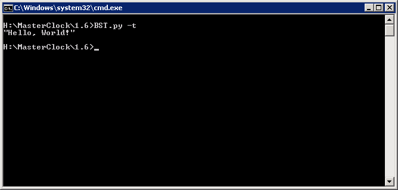

##  Unittests

The command

    $ BST.py -t

launches the script unittest.sh on Unix resp. unittest.bat on Windows.

You may call arbitrary test programs from such scripts, incl. calling Python- or Matlab interpreters.
  
BST.py considers the unittests to have passed as long as the unittest.{sh|bat} script returns 0.

**Example**
  
ToolBOS SDK comes with built-in support for **CuTest**, a very easy to use unittesting "framework" which is actually just a set of C macros. It is supported on both Linux and Windows.
  
**See also**
      - [unittest](../../../../examples/unittest.c)
  
In good cases it might look like this:

     $ BST.py -t
     ................
     
     OK (16 tests)
     
while in case the second testcase failed:

    .F..............
    
    There was 1 failure:
    1) Test_myFunc2: unittest.c:58: expected <42> but was <123>
    
    !!!FAILURES!!!
    Runs: 2 Passes: 1 Fails: 1
    
    
**See also**
    [CuTest: C Unit Testing Framework](http://cutest.sourceforge.net) 