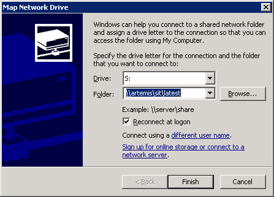
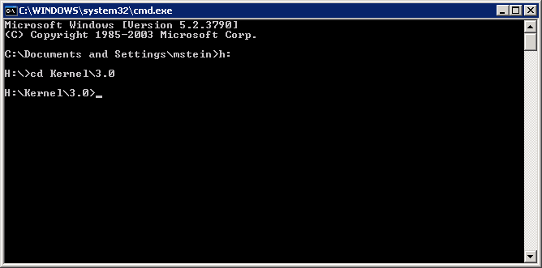
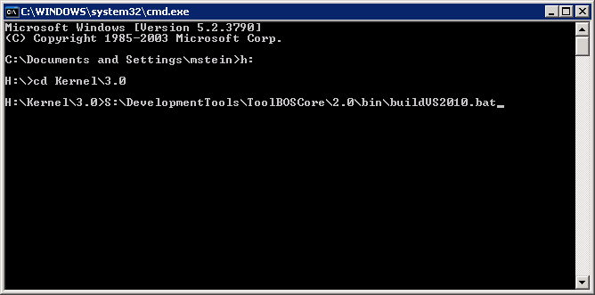
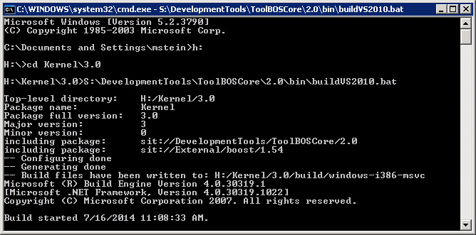

##  VS2010 on WinXP (console)

###  1. Have SIT available on Windows

For a quickstart we expect to have the SIT network share mapped to drive letter 
You can map network drives under "MyComputer" → "Tools" → "Map network drive".

###  2. Step into package'

Open a console (cmd.exe) and navigate to your package.

###  3. Launch build script

Run buildVS2010.bat. This script auto-detects the CPU architecture (32 / 64 bit), 
prepares the environment and then invokes BST.py.

