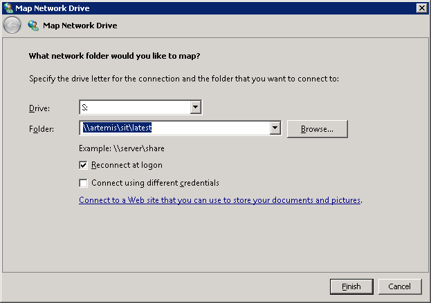
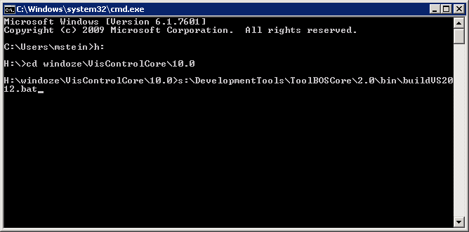
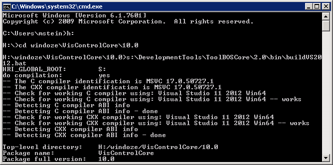

##  VS2012 on Win7

### 1. Have SIT available on Windows

For a quick start we expect to have the SIT network share mapped to drive letter S:\.   
You can map network drives under "Start" → "Computer" → "Map network drive".

###  2. Step into package
     
Open a console (cmd.exe) and navigate to your package.

### 3. Launch build script
    
Run buildVS2012.bat. This script auto-detects the CPU architecture (32 / 64 bit), 
prepares the environment and then invokes BST.py.

